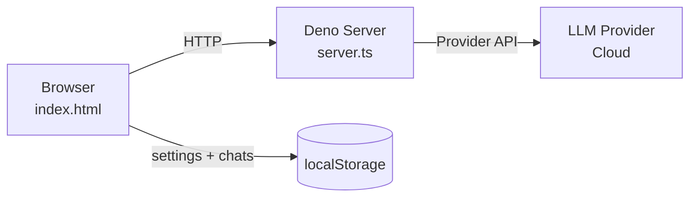

# Local AI Workbench

[](http://unlicense.org/)
[](https://deno.land/)

A privacy-first, local AI chat interface that works with multiple LLM providers. No cloud dependencies, no tracking, just you and your API keys. Built with Deno and vanilla React because sometimes simpler is better.

Tired of sending your data to yet another SaaS platform? Want to experiment with different AI providers without vendor lock in? Need a simple workbench that just works? This is it. 

- **Multi-provider support**: AWS Bedrock, OpenAI, Azure OpenAI, Google Gemini, or really, whatever else you wanna add, its free to be modified/cloned/whatever.
- **Privacy by design**: Everything runs locally, no middleman.
- **Conversation management**: Multiple chats with persistent or one-shot memory modes
- **Browser-based storage**: All settings and history stored in localStorage
- **File attachments**: Upload documents for context (txt, json, md, csv, code files)
- **Provider testing**: Built-in connection tests for each provider
- **Zero backend dependencies**: Single Deno server, single HTML file
- **Resizable UI**: Adjust sidebar width to your preference
- **Generation controls**: Fine tune temperature, top_p, top_k, max_tokens, and provider specific options

Simple local chat UI + Deno API server for multiple providers:

- AWS Bedrock
- OpenAI
- Azure OpenAI
- Google Gemini  

---


## Prerequisites

- [Deno](https://deno.com/) installed
- API credentials for any provider you want to use

## Install Deno (Linux/macOS)

```bash
curl -fsSL https://deno.land/install.sh | sh
source ~/.bashrc
```

Windows (PowerShell):

```powershell
irm https://deno.land/install.ps1 | iex
```

## Clone and Configure

```bash
git clone https://github.com/theelderemo/simple-chat-ui.git
cd simple-chat-ui
cp example.env .env
```

```dotenv
AWS_BEARER_TOKEN_BEDROCK
AWS_DEFAULT_REGION=
OPENAI_API_KEY=
AZURE_OPENAI_API_KEY=
AZURE_OPENAI_ENDPOINT=
GEMINI_API_KEY=
```

All tokens and API keys must be stored in `.env` and loaded by the server.

## Run

From the project root:

```bash
deno run --env-file=.env --allow-net --allow-read --allow-env server.ts
```

Then open:

- http://localhost:8000

Usage
Quick Start

    Configure models in the Settings sidebar → Models tab

    Add a model for your provider with a name and model ID

    Test connection using the provider Test button

    Save Models when configuration is complete

    Switch to General tab and select your model from the dropdown

    Start chatting!

Memory Modes

    One-shot: Each message is sent independently (no conversation history)

    Persistent: Maintains full conversation context across messages

File Attachments

Click the attachment icon to upload documents. Supported formats:

    Text files (.txt, .md)

    Code files (.js, .py, .ts, .html, .css)

    Data files (.json, .csv)

Files are embedded in your message context using XML tags.
Generation Settings

Toggle the "Generation Settings" card in the General tab to adjust:

    Temperature: Controls randomness (0 = deterministic, 2 = creative)

    Top P: Nucleus sampling threshold

    Top K: Limits token selection pool

    Max Tokens: Maximum response length

    Bedrock-specific: Thinking type, output effort, latency optimization

### Architecture Flow




### Frontend:
Single-page React app loaded from CDN (no build step)

### Backend: 
Deno HTTP server handling /api/chat and /api/test-provider

### Storage: 
Browser localStorage for persistence

### State: 
No server-side state—completely stateless backend

## Troubleshooting
### Connection Test Fails

    Verify .env credentials are correct

    Check provider endpoint URLs are accessible

    Ensure model IDs exist in your provider account

    Restart server after .env changes

### "Missing Bedrock bearer token"
    AWS Bedrock requires AWS_BEARER_TOKEN_BEDROCK in .env. This is not the same as AWS access keys.

### Model not showing up
    After adding a model in the Models tab, click "Save Models" before switching to the General tab.

### Files not attaching

    Check file extension is in the allowed list. 

### Development

The entire UI is in index.html with inline React (Babel transpilation at runtime). The backend is server.ts. That's it.

Want to modify the UI? Edit the [index](index.html).
Want to add a provider? Edit server.ts and add a callYourProvider function.

